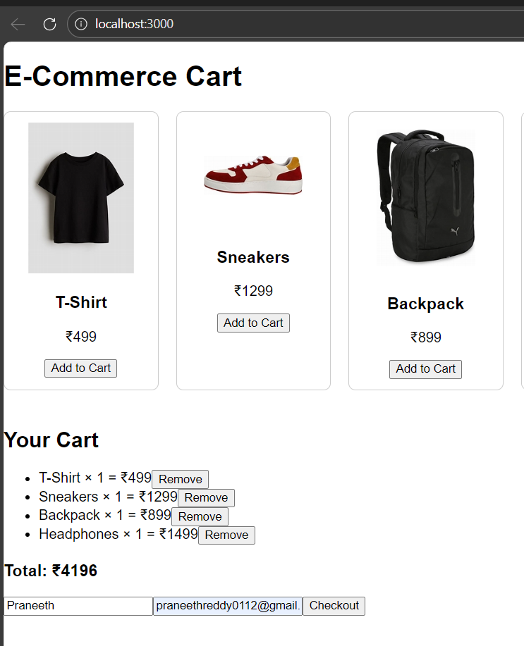
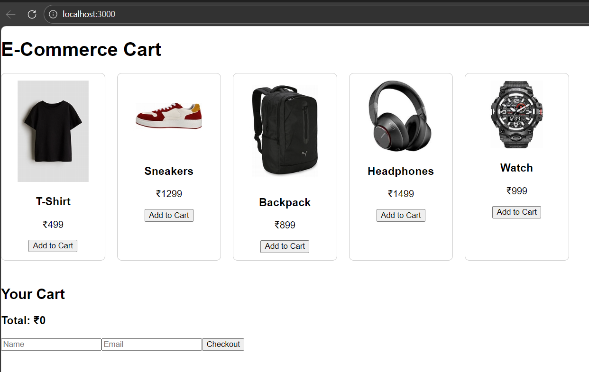
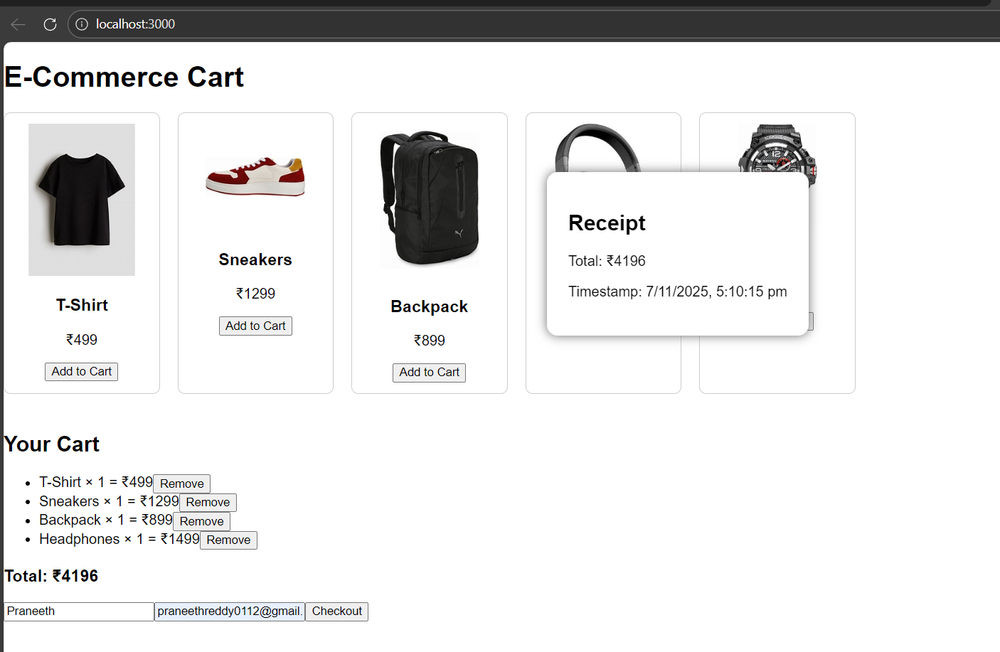

# ECOMMERCEAPP
A modern full-stack e-commerce application built with React, Express, MongoDB, and Mongoose.
Manage a shopping cart, browse products with images, and complete checkout—all with secure API endpoints and modular code.

# 🚀 Features
Browse products in a responsive grid

Add, update, and remove cart items

Cart view with real-time total

Simple customer checkout form

Backend API for products/cart/checkout

Uses MongoDB for persistence

Local product images served via React

# 🗂 Project Structure
text
ECOMMERCEAPP/
├── Backend/
│   ├── controllers/
│   ├── models/
│   ├── routes/
│   ├── config/
│   ├── .env.example             # Backend env template (no secrets!)
│   ├── package.json
│   └── ...
│
├── frontend/
│   ├── src/
│   │   ├── components/
│   │   ├── images/              # Product images (jpg)
│   ├── public/
│   ├── .env.example             # Frontend env template
│   ├── package.json
│   └── ...
├── .gitignore                   # Ignore .env/node_modules
├── README.md

# ⚡ Getting Started
1. Clone & Install

git clone https://github.com/YOUR_USERNAME/ECOMMERCEAPP.git

cd ECOMMERCEAPP

2. Set Environment Variables
 
Duplicate .env.example to .env in both Backend/ and frontend/

Fill in your own MongoDB URI (backend) and API URL (frontend).

3. Install Dependencies

cd Backend

npm install

cd ../frontend

npm install

4. Seed Products

Add product data to MongoDB (via Compass or scripts).

Place matching jpg images in frontend/src/images/.

5. Run Servers

Backend :: cd Backend and npm start

Frontend ::cd frontend and npm start

App runs at http://localhost:3000.

# 🖼️ Screenshots

### Product Grid

### Cart View

### Checkout Page

# 💡 Notes
.env files: Never track or push these—use .env.example for reference.

Security: Reset credentials if environment secrets are ever leaked.

Customization: Fork/extend as needed for inventory, user auth, payments, etc.

# 📄 License
MIT — free for educational and personal use.

